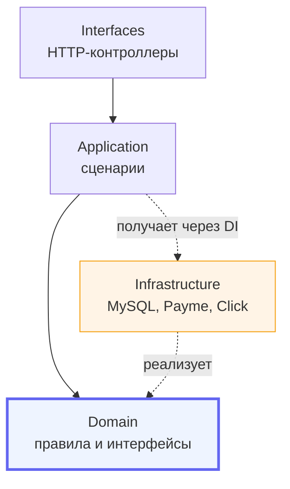

# Слоистая архитектура в PHP: границы, которые реально держат

Как устроен бэкенд складской CRM: четыре слоя, правила зависимостей между ними и
что именно ломается, когда правила нарушают.

Разбор на реальной структуре продакшен-системы. Исходники приватные, доступ по
запросу.

---

## Структура

```
src/
├── Domain/           бизнес-правила и контракты. Не знает ни о чём внешнем
├── Application/      сценарии использования: «принять товар», «провести документ»
├── Infrastructure/   реализации контрактов: БД, платёжные шлюзы, внешние API
├── Interfaces/       вход: HTTP-контроллеры
├── Support/          автозагрузка, конфиг, окружение
└── Legacy/           старый код, изолированный и постепенно вытесняемый
```

Домены внутри: `Catalog`, `Inventory`, `Finance`, `Contragent`, `Payment`,
`Identity`, `OnlineOrder`, `PurchaseOrder`, `Consignment`, `Integration`,
`Analytics`.



**Единственное правило, из которого следует всё остальное:** стрелки ведут внутрь.
`Domain` не импортирует ничего из `Infrastructure`. Инфраструктура зависит от
домена, а не наоборот.

---

## Зачем это, если можно писать в контроллере

Пока система маленькая, разницы нет. Она появляется в трёх местах.

**Первое: у логики становится больше одного входа.** В боевой системе «провести
документ» вызывается из веб-панели, из Telegram-бота и из фонового обработчика.
Если логика живёт в контроллере, у вас три её копии, которые расходятся.

**Второе: внешний сервис меняется.** У платёжного провайдера поменялся формат
callback. Если шлюз за интерфейсом — правка в одном классе. Если он размазан по
контроллерам — правка везде и тестирование всего.

**Третье: тесты.** Доменную логику можно проверить без базы, без сети и без
провайдера — потому что она их не знает.

---

## Контракт в домене, реализация в инфраструктуре

Классический пример — платёжный шлюз. Интерфейс лежит в `Domain/Payment`:

```php
namespace App\Domain\Payment;

interface PaymentGateway
{
    public function providerName(): string;
    public function buildCheckoutUrl(array $order, int $paymentTransactionId): string;
    public function handleWebhook(string $rawBody, array $headers): array;
}
```

Реализации — в `Infrastructure/Payment`: `PaymeGateway`, `ClickGateway`. Домен о
них не знает; он знает только контракт.

Добавление третьего провайдера — новый класс, реализующий тот же интерфейс. Ни
одной правки в домене и сценариях. Если для нового провайдера пришлось менять
контракт — это сигнал, что абстракция протекает, и обсуждать надо её, а не
провайдера.

---

## Сценарий как единица работы

`Application` — это то, что происходит, а не то, как оно хранится. Один сценарий —
одна транзакция, одна ответственность.

```php
namespace App\Application\Inventory\UseCase;

final class PostInventoryDocument
{
    public function __construct(
        private DocumentRepository $documents,   // интерфейс из Domain
        private MovementRepository $movements,   // интерфейс из Domain
        private BalanceUpdater $balances,        // интерфейс из Domain
    ) {}

    public function execute(int $documentId, int $userId): void
    {
        $document = $this->documents->findDraftOrFail($documentId);

        // Движения и пересчёт остатка — в одной транзакции.
        // Иначе при сбое между ними остаток разойдётся с историей,
        // и расхождение будет тихим: ошибки нет, цифры неверные.
        $this->documents->transactional(function () use ($document, $userId): void {
            foreach ($document->items() as $item) {
                $movement = $this->movements->append($document, $item);
                $this->balances->apply($movement);
            }
            $this->documents->markPosted($document, $userId);
        });
    }
}
```

Обратите внимание: в конструкторе — интерфейсы, а не `PDO` и не конкретные классы.
Сценарий не знает, MySQL под ним или что-то другое.

---

## Legacy как отдельный слой, а не как «потом перепишем»

`src/Legacy` — сознательное решение. Старый код не удалён и не переписан разом, он
**огорожен**: новый код в него не заглядывает, а старые вызовы постепенно
переезжают на сценарии.

Это честнее двух популярных альтернатив: «перепишем всё с нуля» (никогда не
заканчивается) и «постепенно поправим на месте» (старое расползается по новому).

Граница видна в структуре папок, а значит нарушение границы видно на код-ревью.

---

## Где границу нарушают чаще всего

Три типичных протечки, за которыми стоит следить:

1. **Модель БД, просочившаяся в домен.** Если доменный объект знает про
   `AUTO_INCREMENT`, `JSON`-колонку или имя таблицы — граница уже нарушена.
2. **Сценарий, собирающий HTTP-ответ.** Форматирование ответа — работа
   `Interfaces`. Сценарий возвращает данные, а не JSON со статус-кодом.
3. **Контроллер с бизнес-условиями.** Как только в контроллере появляется
   «если статус draft и роль менеджер» — это уехало из домена.

---

## Автозагрузка: ловушка регистра, стоившая продакшена

Реальная история из соседнего проекта, прямо про границы и дисциплину.

Файл назывался `src/database.php` со строчной буквы, а класс внутри —
`App\Database`. PSR-4 ищет файл `src/Database.php` с заглавной.

На Windows файловая система нечувствительна к регистру, поэтому локально всё
работало годами. На Linux — а это любой хостинг — **все страницы админки упали**
с `Class "App\Database" not found`. Уцелели только те файлы, где подключение было
явным, через `require_once`.

Второй такой же случай в том же проекте: класс числился в `autoload.files`, куда
попадают только файлы с функциями и побочными эффектами, а не классы.

Вывод, который дороже правила: **проверять проект на регистрозависимой файловой
системе до деплоя**, а не после. Одна команда в Docker-контейнере ловит это за
минуту.

---

## Что спрашивать у кандидата по этой теме

Если вы читаете это как нанимающий — вот вопросы, которые отличают понимание от
пересказа:

- Почему интерфейс репозитория лежит в домене, а реализация в инфраструктуре?
- Что произойдёт, если пересчёт остатка вынести из транзакции с движением?
- Когда слои — лишняя сложность, а не польза?
- Как вы огораживаете legacy, если переписать нельзя?

---

## Смежные заметки

- [db-schema-notes](https://github.com/Shohruh1997/db-schema-notes) — схемы БД этих же систем
- [inventory-accounting-notes](https://github.com/Shohruh1997/inventory-accounting-notes) — доменная логика склада
- [payment-integration-notes](https://github.com/Shohruh1997/payment-integration-notes) — шлюзы за интерфейсом

---

Шохрух Рузиев · backend-разработчик, Ташкент · [ecomdev.uz](https://ecomdev.uz)
